# Distributed Kalman filtering under partially heterogeneous models (source code)

Source code for the simulation experiments of the master's thesis [**Distributed Kalman filtering under partially heterogeneous models (2021)**](https://raw.githubusercontent.com/maiquang/maithanh-thesis-src/master/DP_Mai_Thanh_Quang_2021.pdf) by Thanh Quang Mai, FIT CTU.

## Abstract
This thesis explores the problem of distributed Kalman filtering under partially heterogeneous models. A modification to the existing diffusion Kalman filter is proposed, enabling the employment of partially heterogeneous models in the diffusion networks. The performance of the less complex models is futher improved by the implementation of a node failure detection heuristic, resetting the failling nodes, and giving them a chance at a recovery.

# Summary
## Linear state-space model
Consider a model in the following form:
<!-- $$
\begin{aligned}
    x_t & = A_tx_{t-1} + B_tu_{t} + w_t, \\
    y_t & = H_tx_t + v_t,
\end{aligned}
$$ -->

where <!-- $x_t$ -->  is the latent state, <!-- $y_t$ -->  is an observable (noisy) output, <!-- $u_t$ -->  is a **known** input variable, and <!-- $A_t$ --> , <!-- $B_t$ --> , <!-- $H_t$ -->  are known matrices of compatible dimensions. Noise variables <!-- $w_t$ -->  and <!-- $v_t$ -->  are zero-mean, mutually independent and identically distributed.

The goal is to estimate the latent state <!-- $x_t$ -->  (e.g., an object's position in 2D space) based on inputs <!-- $u_t$ -->  and noisy observations <!-- $y_t$ -->  (e.g., sensor readings) at each time-step <!-- $t = 0, 1, 2, \ldots$ --> .

  

## Kalman filter
The Kalman filter is used to estimate the latent state <!-- $x_t$ --> . It does assume both the process noise <!-- $w_t$ -->  and observation noise <!-- $v_t$ -->  to be mutually independent and zero-mean Gaussian. The filtration runs in two steps:
- **prediction** - predicts the next state <!-- $x_t$ -->  using the state evolution model above,
- **update** - incorporates a new measurement (observation) <!-- $y_t$ -->  into the estimate of the hidden state <!-- $x_t$ --> .

## Diffusion Kalman filter
Assume Kalman filters connected into a **diffusion network**, in which the network nodes communicate only locally, i.e., only with their adjacent neighbors. Employing the adapt-then-combine (ATC) diffusion strategy, the filtering proceeds as follows:
- **local prediction** - the traditional Kalman filter prediction step,
- **adaptation** - incorporates its own and its neighbors' observations (e.g., sensor readings),
- **combination** - create a new estimate by combining the neighbors' estimates (the estimates of <!-- $x_t$ -->  can be, for example, probability distributions).

## Partially heterogeneous models
The state-of-the-art methods for distributed Kalman filtering mostly assume spatial homogeneity of the state-space models. This work focuses on partially heterogeneous models, where the state-space of the less complex (or underspecified) models is a subspace of more complex model state-space. The simulation examples are run using the
1. Random-walk model (RWM)
2. Constant velocity model (CVM)
3. Constant acceleration model (CAM)

The models ordered by complexity are:
<!-- $$
\text{RWM} \leq \text{CVM} \leq \text{CAM}.
$$ -->

Naturally, in an isolated environment with no collaboration among the nodes, the estimation performance and stability of the more complex models is significantly better than that of the underspecified models. The goal is to improve the estimation performance and stability of the RWM model by collaboration among the nodes.

The thesis proposes a modification to the existing diffusion Kalman filter. The local prediction and adaptation steps from the diffusion Kalman filter are preserved. The combination step is slightly modified, only estimates from neighbors of the same or better complexity are combined. In addition, a simple node failure detection method is proposed to further improve the performance of the underspecified models. Each node checks for inconsistency between its own estimate and the estimates of its neighbors (here Euclidean distance is used), when a failure is detected, the node is reset and reinitialized with a new estimate (in this case - an arithmetic mean of the neighbors' estimates).

# Results
The performance of the proposed diffusion filter is evaluated on the following simulation examples. The nodes of the diffusion network observe a noisy realization of a 2D trajectory. The data is simulated from the initial state <!-- $x_{0}  = \begin{bmatrix} 0 & 0 & 0 & 0 & 0 & 0 \end{bmatrix}^{\intercal}$ -->  using the CAM. While the observation noise is the same for all the nodes, each node receives a different set of measurements. The nodes employ one of these models - RWM, CVM, or CAM. The results are averaged over 100 independently simulated trajectories for <!-- $t = 1, 2, \ldots, 1000$ --> . The simulations were run on a network with 15 nodes with 2 RWMs, 4 CVMs and 9 CAMs. In the first scenario, the models employed by each node are fixed between consecutive simulation runs, in the second scenario, the models are randomly assigned to the nodes in each simulation run. The strategies tested were (i) no cooperation, (ii) adapt-then-combine (ATC), and (iii) ATC + failure detection.

## The network topology used in the simulation - 2 RWM nodes (red), 4 CVM nodes (blue) and 9 CAM nodes.

  
  

## An example of one simulated trajectory.

  
 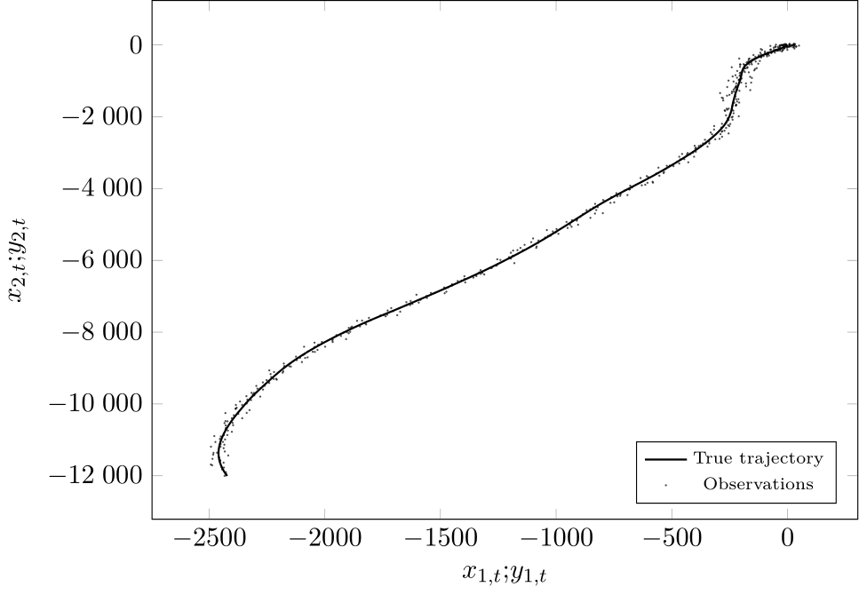 

## State and state estimate of a randomly selected run for a CAM trajectory

  
 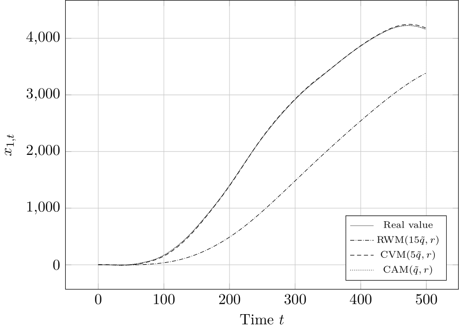  

## No cooperation. Fixed initialization. Average RMSE of nodes employing the same model, averaged over 100 simulations.

  
 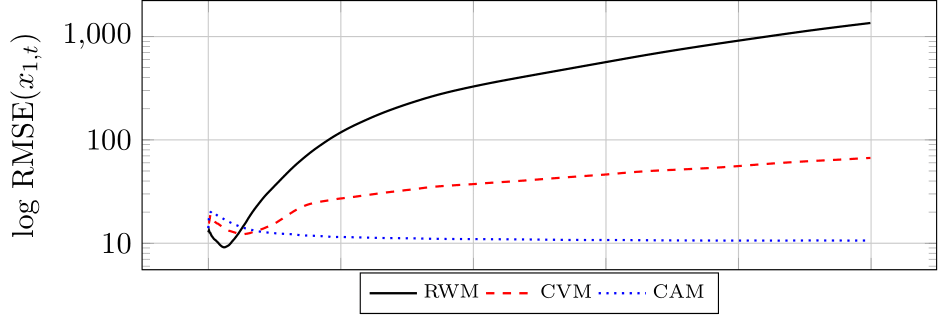 

  
 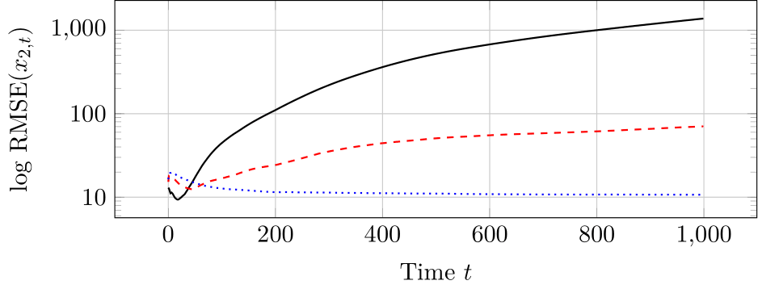 

## ATC only. Fixed initialization. Average RMSE of nodes employing the same model, averaged over 100 simulations.

  
 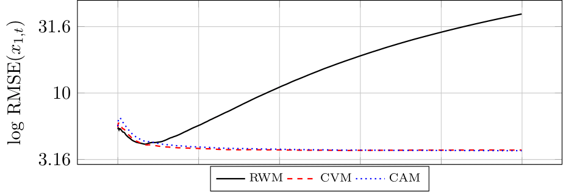 

  
 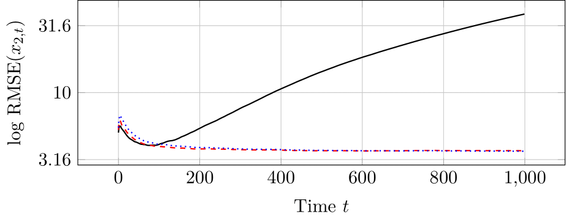 

## ATC + Failure detection. Fixed initialization. Average RMSE of nodes employing the same model, averaged over 100 simulations.

  
 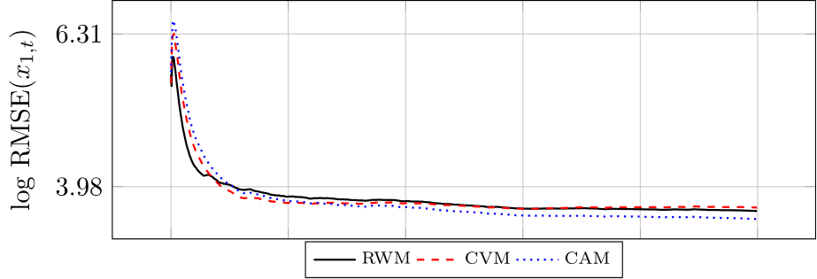 

  
 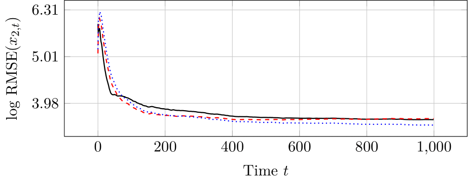 

## ATC + Failure detection. State and state estimate evolution for a randomly selected RWM node. Filter resets shown.

  
 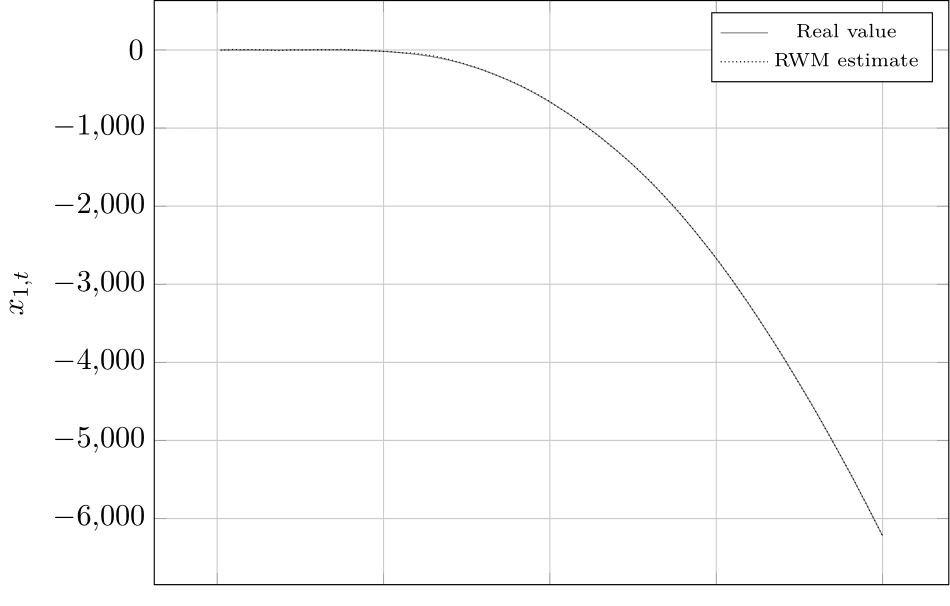 

  
 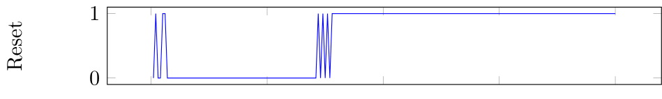 

  
 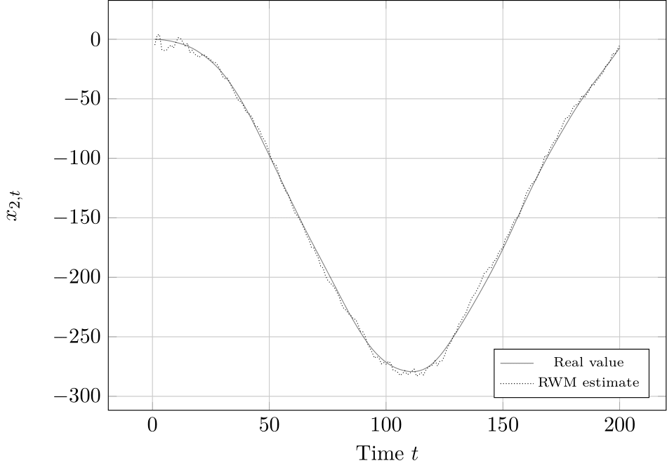 

The full results can be found in the [thesis text]((https://raw.githubusercontent.com/maiquang/maithanh-thesis-src/master/DP_Mai_Thanh_Quang_2021.pdf)) [Chap. 5].